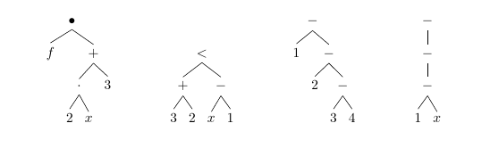

# Exercise 2.2.3 (Redundant parentheses)

> Give lexical representations for the following syntax trees not using redundant parentheses:
>
> 

---

The first syntax tree gives the following expression:
```text
f (2 ⋅ x + 3)
```

The second syntax tree gives the following expression:
```text
3 + 2 < x - 1
```

The third syntax tree gives the following expression:
```
1 - (2 - (3 - 4))
```

The fourth syntax tree gives the following expression:
```
--(1 - x)
```
